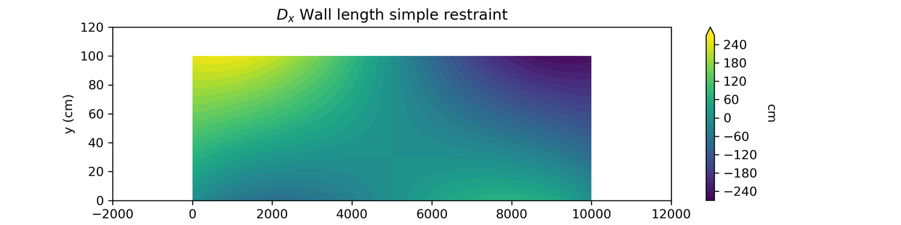
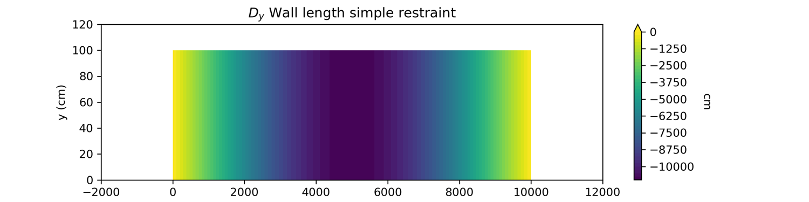
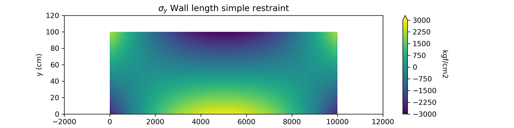

# FNELEM-GPU

Simple finite elements matrix structural analysis using GPU. Supports 2D planar membrane/shell.

## Requirements

C++ STANDARD 14 and CUDA. No other libraries are needed.

## Import

To fully use this library, you must include the following files:

```cpp
#include "fnelem/math/fematrix.cpp"
#include "fnelem/math/fematrix_utils.cpp"
#include "fnelem/math/matrix_inversion_cpu.cpp"
#include "fnelem/math/matrix_inversion_cuda.cu"

#include "fnelem/analysis/static_analysis.cpp"
#include "fnelem/model/base/model.cpp"
#include "fnelem/model/base/model_component.cpp"
#include "fnelem/model/elements/element.cpp"
#include "fnelem/model/elements/membrane.cpp"
#include "fnelem/model/loads/load.cpp"
#include "fnelem/model/loads/load_membrane_distributed.cpp"
#include "fnelem/model/loads/load_node.cpp"
#include "fnelem/model/loads/load_pattern.cpp"
#include "fnelem/model/loads/load_pattern_constant.cpp"
#include "fnelem/model/nodes/node.cpp"
#include "fnelem/model/restraints/restraint.cpp"
#include "fnelem/model/restraints/restraint_node.cpp"
```

## Usage

### Model

The model class is the base object for defining a problem. It needs the number of degrees of freedom, the dimension (actually, only 2D is supported), the nodes, elements, restraints, loads, and load patterns.

```cpp
Model *model = new Model(dimension, number_degrees_of_freedom);

// Define nodes
model->add_nodes(nodes);
model->add_elements(elements);
model->add_restraints(restraints);
model->add_load_patterns(load_pattern);
```

Nodes, elements, restraints, and load_pattern are **std::vector** objects containing library Objects.

### StaticAnalysis

The StaticAnalysis class performs the primary static analysis method. Using the model definition, it creates the structure stiffness matrix, and then, using ``K*u = F``, it solves the displacement vector of the nodes.

```cpp
StaticAnalysis *analysis = new StaticAnalysis(model);
analysis->analyze(use_gpu);
```

If *use_gpu* is true, GPU performs the primary matrix inversion. After the analysis, the model can save the results into a file. That file contains the main structure elements: nodes, shells, reactions, and internal forces of the elements.

```cpp
model->save_results("file.txt");
```

Example of the output:

```
FNELEM-GPU -  Finite element structural analysis using CUDA and GPU.
              v0.2.0 (21/12/2018) @ ppizarror

--------------------------------------------------------------------
Input model properties:
--------------------------------------------------------------------

Nodes:
	Node count:	6
	Node N1:	0.000000	0.000000
	...

Elements:
	Element count:		2
	Membrane MEM1:
		Width (2b):		2
		Height (2h):	2
		Thickness:		1
		Elastic mod:	2000
		Poisson mod:	0.2
		Element nodes:	N1, N3, N4, N2
	...

--------------------------------------------------------------------
Analysis results:
--------------------------------------------------------------------

Node displacements:
	Node N1:	0.000000	0.000000
	...

Node reactions:
	Node N1:	369.158879	500.000000
	...

Element stresses:
	Membrane MEM1:
		Node N1 (-b, -h):	369.159,	500
		Node N3 (+b, -h):	130.841,	0
		Node N4 (+b, +h):	-500,	-500
		Node N2 (-b, +h):	0,	0
		Stress MEM1 [GLX GLY X Y SIGMAX SIGMAY SIGMAXY DISPLX DISPLY]
			0 0 -1 -1 -44.3925 -221.963 -193.9250 0
			...
```

### Node

The node class must be defined using the global coordinates. Nodes are used by the elements.

```cpp
std::vector<Node *> *nodes = new std::vector<Node *>();
nodes->push_back(new Node(node_tag, coordinate_x, coorinate_y));
nodes->push_back(new Node(node_tag, coordinate_x, coordinate_y, coordinate_z));
```

### Element

The membrane shell must be defined using four nodes, the elastic and Poisson modulus, and the thickness.

```cpp
std::vector<Element *> *elements = new std::vector<Element *>();
elements->push_back(new Membrane(membrane_tag, node1, node2, node3, node4, E, poisson, thickness));
```

### Restraints

The restraint class must be used when a node cannot move in any direction.

```cpp
std::vector<Restraint *> *restraints = new std::vector<Restraint *>();
RestraintNode *r = new RestraintNode(restraint_tag, node);
r1->add_dofid(index);
r1->add_all(); // This method adds all degrees of freedom
restraints->push_back(r);
```

### Load

#### LoadNode

NodeLoad is a load applied to a node; it needs the node reference and a load vector. In FNELEM-GPU matrices and vectors are defined using **FEMatrix** class. That class provides the following main methods:

- Add
- Subtract
- Multiply
- Inverse (Using CPU and GPU)
- Determinant
- max(), min()
- clone()

To define a vector:

```cpp
FEMatrix *vector = FEMatrix_vector(size);
vector->set(index, value);
vector->get(index); 
```

To define a matrix:
```cpp
FEMatrix *matrix = FEMatrix_vector(n, m);
matrix->set(i, j, value);
matrix->get(i, j); 
```

Then, node load is defined by:

```cpp
// Create load vector
std::vector<Load *> *loads = new std::vector<Load *>();

// Create LoadNode
FEMatrix *load = FEMatrix_vector(size);
load->set(index, value);
...
loads->push_back(new LoadNode(load_tag, node, load));
```

#### LoadMembraneDistributed

This class can apply a distributed load. It needs the membrane, the node position (1, 2, 3, 4)

<div align="center">

</div>

```cpp
std::vector<Load *> *loads = new std::vector<Load *>();
loads->push_back(new LoadMembraneDistributed(load_tag, membrane, position_initial,
    position_final, load_at_initial, distance_from_initial, load_at_final, distance_from_initial));
```

### Load pattern

The load pattern must be used to apply the loads to the model. Only the constant load pattern is defined.

```cpp
std::vector<LoadPattern *> *loadpattern = new std::vector<LoadPattern *>();
loadpattern->push_back(new LoadPatternConstant(load_tag, loads));
```

## Example

The following code defines a simple bridge composed of N membranes under a distributed load of 100kN/m. The membranes are the same: 100cm height, 100cm width, 15cm thickness, elastic modulus of 300000kN/cm^2, Poisson modulus of 0.2. This example can also be found in [test/analysis/test_static_analysis.h](https://github.com/ppizarror/FNELEM-GPU/blob/master/test/analysis/test_static_analysis.h).

<div align="center">

</div>

```cpp
int N = 3; // Number of membranes
int b = 100; // Pier width
int h = 100; // Pier height

//    N = 2
//       4 ------ 5 ------ 6
//       |        |        |
//     h |   (1)  |   (2)  |  ......
//       |        |        |
//       1 ------ 2 ------ 3 .....
//       ^    b            ^
//
//    N = 3
//       4 ------ 5 ------ 6 ------- 8
//       |        |        |         |
//     h |   (1)  |   (2)  |   (3)   |
//       |        |        |         |
//       1 ------ 2 ------ 3 ------- 4
//       ^    b                      ^
// =====================================

double t = 15; // Thickness (cm)
double E = 300000; // Elastic modulus
double nu = 0.15; // Poisson modulus

// Number degrees of freedom
int gdl = N * 4;

// Create model
Model *model = new Model(2, gdl);

// Create nodes
std::vector<Node *> *nodes = new std::vector<Node *>();
int j;
for (int i = 1; i <= N + 1; i++) {
    nodes->push_back(new Node("N" + std::to_string(i), b * (i - 1), 0));
}
for (int i = 1; i <= N + 1; i++) {
    j = N + 1 + i;
    nodes->push_back(new Node("N" + std::to_string(j), b * (i - 1), h));
}

// Add nodes to model
model->add_nodes(nodes);

// Create elements
// n4 ------------ n3
//  |              |
//  |      (i)     |
//  |              |
// n1 ------------ n2
unsigned long n1, n2, n3, n4;
std::vector<Element *> *elements = new std::vector<Element *>();
for (unsigned long i = 0; i < N; i++) {
    n1 = i;
    n2 = i + 1;
    n3 = N + i + 2;
    n4 = N + i + 1;
    elements->push_back(new Membrane("MEM" + std::to_string(i), nodes->at(n1),
		nodes->at(n2), nodes->at(n3), nodes->at(n4), E, nu, t));
}
model->add_elements(elements);

// Create restraints
std::vector<Restraint *> *restraints = new std::vector<Restraint *>();
RestraintNode *r1 = new RestraintNode("R1", nodes->at(0));
RestraintNode *r2 = new RestraintNode("R2", nodes->at(static_cast<unsigned long>(N)));
r1->add_all();
r2->add_all();
restraints->push_back(r1);
restraints->push_back(r2);
model->add_restraints(restraints);

// Add distribuited load
std::vector<Load *> *loads = new std::vector<Load *>();
for (int i = 0; i < elements->size(); i++) {
    Membrane *mem = dynamic_cast<Membrane *>(elements->at
        (static_cast<unsigned long>(i)));
    loads->push_back( new LoadMembraneDistributed("DV100kN V @" +
        std::to_string(i + 1), mem, 4, 3, -100, 0, -100, 1));
}
std::vector<LoadPattern *> *loadpattern = new std::vector<LoadPattern *>();
loadpattern->push_back(new LoadPatternConstant("LOADCONSTANT", loads));
model->add_load_patterns(loadpattern);

// Create analysis
StaticAnalysis *analysis = new StaticAnalysis(model);
analysis->analyze(false);

// Save results to file
model->save_results("bridge.txt");

// Delete data
analysis->clear();
delete elements;
delete loadpattern;
delete loads;
delete restraints;
delete nodes;
delete model;
delete analysis;
```

The results are the following:






GPU analysis will be faster if *N* (number of membranes) is greater.
<div align="center">

</div>

## License

This project is licensed under MIT [https://opensource.org/licenses/MIT/]

## Author

[Pablo Pizarro R.](https://ppizarror.com) | 2018 - 2019
